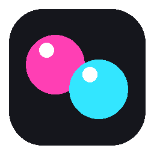

<p align="center"></p>

# The Mover

**but here's the mover**

Play *any* PC game with two PlayStation Move controllers and a PS3 Eye camera.
The Mover turns swings, tilts, pointing, punching and steering-wheel grips into the
keyboard, mouse and Xbox-gamepad input your game already understands, and its built-in
AI Coach (Claude) can watch you play for a minute and design a motion mapping for that game.

- **Plug and play**: one executable, a big PLAY button, sensible defaults, built-in profiles.
- **Every controller feature**: buttons, analog trigger, accelerometer, gyroscope, orientation,
  sphere colour tracking (x / y / depth) through the camera, rumble and LED feedback.
- **Any game**: output as keyboard keys (DirectInput scan-codes), mouse motion / clicks / absolute
  pointer, and a virtual Xbox 360 gamepad.
- **AI Coach**: record 45 seconds of you playing with keyboard/mouse, Claude analyses screenshots +
  input statistics and returns a full profile ("hold both controllers like a wheel…").
- **Chat box**: "steering is too twitchy", "make jump a flick up", "buzz the left controller" -
  Claude edits the live profile with tools, changes apply instantly.
- **Regular mapping too**: a full editor for bindings, curves, deadzones, thresholds, feedback rules,
  templates, import/export.
- **Simple by default, Advanced on demand**: the app shows plain-English mappings ("Strike down with
  right hand → Key J") and a readiness checklist; the **Advanced** switch in the header reveals raw
  signal names, every numeric option and all device/engine settings for pro users.

---

## 1. Quick start (Windows)

1. **Get the app**: download `TheMover.exe` from the Releases page (or build it, see below).
2. **Virtual gamepad (optional but recommended)**: install the
   [ViGEmBus driver](https://github.com/nefarius/ViGEmBus/releases) so The Mover can appear
   as an Xbox 360 controller. Keyboard/mouse output works without it.
3. **Camera**: plug in the PS3 Eye. Windows has no built-in driver for it, pick one:
   - **CL-Eye Driver** (or any driver that makes it a normal webcam) - The Mover then uses it
     through the "opencv" backend, or
   - **libusb via [Zadig](https://zadig.akeo.ie/)** + `pip install git+https://github.com/bensondaled/pseyepy`
     (only when running from source) - the "pseye" backend.
   Any ordinary webcam also works; tracking only needs to see the glowing spheres.
4. **Controllers**: pair each PS Move with
   [PSMoveServiceEx](https://github.com/Timocop/PSMoveServiceEx) (its config tool has a USB pairing
   step that writes your PC's Bluetooth address into the controller). Once Windows lists a controller
   as *Motion Controller*, The Mover detects it by itself. The Mover does **not** pair controllers.
   - Close PSMoveService itself while playing; The Mover talks to the controllers directly and the
     two would fight over the LEDs and rumble.
   - The **Devices** tab lists every controller found, which slot it is in (1 = right hand,
     2 = left hand), and offers **Swap 1 ↔ 2** and **Identify** (buzz + flash). Slots are remembered
     by Bluetooth address, so each controller keeps its slot across restarts. Controllers can be
     switched on or off at any time; The Mover rescans every 3 seconds.
5. **Play**: choose a profile (Driving wheel, Sword & shield, FPS pointer, Boxing, Platformer,
   osu! taiko drums, Generic gamepad, Desktop pointer), start your game, press **PLAY**. Holding
   the **PS button** on controller 1 for a second toggles Play from the couch. The *Ready to play?*
   checklist on the Play tab tells you exactly what is still missing for the chosen profile, with
   direct download links when no controller is found (PSMS Virtual Device Manager + PSMoveService).
   The **How to play** panel animates both controllers acting out the profile's motions (wheel,
   tilts, swings, drum strikes, pointing, trigger), with rumble arcs and sphere flashes where the
   profile gives feedback. It is derived from the bindings, so coach-built profiles get one too.

Every built-in profile uses the whole controller where it fits the game: analog trigger, face
buttons for menus, orientation, gestures, themed sphere colours (orange/blue for the wheel, red/blue
drumsticks, ...) and 2-5 feedback rules mixing continuous rumble (engine, dash), impact pulses
(shots, hits, gear changes) and LED colour flashes (brake-light red, reload green, guard blue). The
coach is told to do the same for the profiles it designs.

Without any hardware the app still runs with simulated controllers and a synthetic camera so you
can explore the mapping editor and the AI Coach.

## 2. AI Coach (Claude)

1. **Setup** → paste your Anthropic API key (console.anthropic.com) → **Save & test**.
   The key is stored only in your user profile folder (`%APPDATA%\TheMover\settings.json`).
2. **AI Coach** → optionally type the game name and a note ("I want to swing to attack") →
   **Record** → alt-tab into the game and play normally for the countdown. The Mover takes ~1
   screenshot per second and logs which keys you hold/tap, mouse motion and clicks.
3. **Analyze & build mapping**. Claude works out the genre and controls and returns a profile.
   It becomes active immediately, is saved to your library and explained in the chat.
4. Use the **chat box** to tune anything. Claude can read the current profile, read live
   controller signals, add/modify/remove bindings, change feedback rules, colours and sensitivity,
   buzz a controller or save the profile.

How the coach thinks: it first works out what the game is and what every input does (held keys =
movement, taps = actions, continuous mouse = aim), then commits to one physical metaphor themed to
that game (a steering wheel for racing, holding the right controller like a gun with a flick to
reload for shooters, sword and shield for melee, drumsticks for rhythm games) and keeps it playable:
essentials on tilt, triggers and buttons, gestures for the satisfying occasional actions. It uses
only the features that add fun, and the camera only where it clearly helps (light-gun pointing,
two-hand wheel, boxing lean). Its structured analysis (game, genre, inputs, metaphor, why the
camera was or was not used, playability concerns) is shown after each build.

### Full access: the coach can extend the app

The coach is not limited to the mapping vocabulary. With **Full access** on (AI Coach tab, default on)
it also gets developer tools: it can read the app's own source, run a snippet inside the running app,
and write **plugins**: small Python files in `TheMover/plugins/` that are loaded immediately and run
inside the app with access to everything (controllers, camera tracker, engine, output sink). A plugin
can publish new sources (`plugin.<name>`) for normal bindings, or press keys, move the mouse, rumble
and flash on its own. So if you ask for something the bindings cannot express (a two-shake reload, a
lasso, a two-hand distance zoom, a macro, a custom detector) the coach builds it instead of saying no.
The code it writes is shown in the chat and listed under the chat box; plugins survive restarts, are
disabled after repeated errors, and can be deleted by the coach or by removing the file.
Outputs from plugins only reach the game while PLAY is on, so trying things is safe.

### Coach logs

Every analysis and chat turn is written to `%APPDATA%\TheMover\coach_logs\`:

- `coach_log.jsonl`: one JSON line per event with the recording summary, the structured analysis,
  the resulting profile, tool calls made during chat, Claude's summarised reasoning, model, token
  usage and timing.
- `analysis-<timestamp>.md`: a readable report per build (what the coach saw, its analysis and
  reasoning summary, the play style, the bindings).
- Recordings themselves (screenshots + input events) stay in `recordings\<timestamp>\`.

Past chat feedback about the same game is fed back into the next analysis of that game, so
"aim is too fast" said once is remembered next time you rebuild the controls.

Default model: `claude-opus-5` (changeable under Advanced in Setup). Requests use adaptive thinking, prompt
caching for the stable system prompt, and the server-side refusal fallback, so a declined request
is automatically retried on a fallback model.

## 3. How mapping works

A **profile** is a JSON file with *bindings* and *feedback rules*.

```
source  ->  target   (mode + options)
c0.trigger            -> gamepad.right_trigger   axis, input_range [0,1]
wheel.angle           -> gamepad.left_stick_x    axis, input_range [-70,70], deadzone 0.04
c0.gesture.swing_left -> mouse.left              tap 80 ms
c1.orient.pitch       -> key.w                   hold when > 15 degrees
c0.track.x            -> mouse.abs_x             absolute pointer
```

**Sources** (`c0` right hand, `c1` left hand): `button.<name>`, `trigger`, `gesture.<swing_left|
swing_right|swing_up|swing_down|thrust|pull|flick|shake|swing_any>`, `orient.<roll|pitch|yaw>`,
`accel.<x|y|z>`, `gyro.<x|y|z>`, `track.<x|y|depth|vx|vy|tracked>`, `motion.<strength|angular_speed>`,
plus `wheel.angle` (tilt of the line between both spheres, or roll of controller 1) and
`both.<distance|center_x|center_y|depth_avg|height_diff>`.

**Targets**: `key.<a..z, 0-9, f1-f12, space, enter, esc, shift, ctrl, alt, arrows, ...>`,
`mouse.<left|right|middle|x1|x2>`, `mouse.move_x/move_y/wheel`, `mouse.abs_x/abs_y`,
`gamepad.<a|b|x|y|lb|rb|back|start|ls|rs|guide|dpad_*>`, `gamepad.<left_stick_x|left_stick_y|
right_stick_x|right_stick_y|left_trigger|right_trigger>`.

**Modes**: `hold`, `tap`, `toggle`, `repeat`, `axis`, `mouse` (relative), `absolute`, or `auto`.
Options: `threshold`, `compare`, `input_range`, `deadzone`, `scale`, `invert`, `curve`, `smoothing`,
`tap_ms`, `repeat_ms`.

**Feedback**: `{"when": "c0.gesture.swing_any", "controller": 0, "rumble": 0.9, "duration_ms": 120,
"led": [255,255,255]}` or continuous `{"rumble_from": "c0.trigger", "controller": 0}`.

### Profile library

Every profile is a JSON file in `%APPDATA%\TheMover\profiles\`. On first run the built-in
templates are copied there, so they are ordinary profiles: the coach can rewrite them, the editor
can change any binding, and **every change is saved automatically** to the active profile (no
Save button to remember). Coach-built profiles land in the same library and behave the same way.

- **New from template…** creates a fresh copy of a built-in template (names get a number if taken).
- **Save as…** stores a copy under a new name and switches to it.
- **Reset to default** restores the built-in version of a profile that started from a template.
- **Delete profile** (Advanced) removes it; a deleted template stays gone until you use
  *New from template* again.
- Import/Export (Advanced) move profiles as JSON files.

### osu! taiko (rhythm games): how hits are detected

A drum stroke with a Move is a wrist snap. The accelerometer inside the handle sees one big lobe of
acceleration (5–13 g on a real player) that peaks at the impact; because the controller itself rotates
during the snap, *directions* in the controller frame swing around, so the detector keys on the
**size** of the lobe, not on a direction reversal:

- **hit_mode peak** (default): the hit fires the moment the lobe starts to fall, i.e. at the impact,
  one or two samples late (2–5 ms at the ZCM2's ~470 Hz). **rise** fires when the lobe crosses `hit_g`
  on the way up (earlier, slightly more jitter). Hits are pressed straight from the controller's
  reader thread, bypassing the engine tick.
- **hit_g** is how hard a stroke must be; a hysteresis plus a 45 ms refractory time keep one stroke
  one hit while still allowing fast same-hand repeats (rolls alternate hands anyway).
- **Don vs kat** is decided by per-hand **stroke signatures** learned from *your* tagged recording:
  the direction of the impact and the direction the lobe started in, compared by cosine similarity;
  strokes unlike every signature (rebounds, wobbles) are ignored (`min_proto_cos`). Without a
  recording the app falls back to the lobe angle against gravity (`kat_angle_deg`), which is much
  weaker. Holding the trigger forces kat, holding Move forces don.
- Timestamps from Bluetooth arrive in bursts; the reader spreads samples evenly so timing is
  consistent, and the fine-tune scoring compensates the constant delay between your video tags and
  the strokes (tags on a 20 fps video lag the motion by 100–200 ms).

On the reference recording (two ZCM2 controllers, 20 strokes) every stroke of both hands is detected
and don/kat are classified 19/20 in leave-one-out; the one miss is a very soft left-hand don.

### Fine-tune from a recording (the Fine-tune tab)

Works for any profile, not just rhythm games: when the app does not react the way *you* move,
record it, tag it, and let the coach tune the profile from real data.

1. Pick the profile to tune on the Play tab (taiko, sword, wheel, shooter...), open **Fine-tune**,
   choose a length and whether to include camera footage (320×240, ≤ 20 fps, ~2 MB/min) and/or
   screen footage (640 px wide, ≤ 10 fps, ~4 MB/min), press **Record** and play for real. Every
   controller frame (accelerometer, gyro, trigger, buttons, roll/pitch/yaw, camera position) is
   stored at full report rate, together with every hit and gesture the detectors fired, every key /
   mouse / gamepad button the mapping sent to the game, and (optionally) your own keyboard/mouse.
2. The timeline shows both hands (|accel|−1 g thick, components thin, trigger shaded), hits as
   triangles, gestures as labelled diamonds, a "sent to game" lane with the presses the mapping
   made, and the video frame at the cursor. Click/drag to scrub, wheel to zoom, Shift+wheel to
   pan, ← → to step 10 ms, Space to play.
3. Put the cursor where something *should* have happened and tag it. The tag box suggests what
   fits the active profile: its hit kinds (`don` / `kat`), its gestures (`swing_left`, `thrust`...),
   its outputs (`key.space`, `mouse.left`...), plus `nothing` (= nothing should fire here) and free
   notes ("wheel should be centred"). Keys: 1–9 tag with the n-th suggestion, D/K don/kat,
   N nothing. Tags are saved with the recording.
4. **Auto-fit locally** replays the recording through the same detectors the game uses and searches
   the tuning the tags need: hit settings (onset, stop, kat angle, refractory) for don/kat tags,
   gesture sensitivity and cooldown for gesture tags. It applies the best result; hollow markers
   show what fires with the new tuning.
5. **Send everything to the coach** hands the recording, tags, thumbnails at each tag, the bindings
   in use, the current score and your explanation to Claude with tools to inspect the raw samples
   around a tag (including orientation and camera position), evaluate candidate tuning against the
   tags, auto-fit, apply tuning, and edit the profile itself (bindings, ranges, modes) for action
   tags and notes. It reports what changed and how well it now scores. Everything is logged in
   `coach_logs`.

Tuning lives in the profile (`hit_config`, `gesture_sensitivity`, `gesture_cooldown_ms`) so a
tuned profile stays tuned.

Preset keys: right hand J (don) / K (kat), left hand F (don) / D (kat), Cross = Enter, Circle = Esc,
Triangle / Square scroll the song list, F2 random, ` quick retry. Rumble thumps on every hit.
Tune with the coach ("hits register too easily" lowers sensitivity) or, in Advanced, edit the
bindings directly.

## 4. Setup tab

Simple view: controller status with **Identify** (buzz + flash) and **Swap 1 ↔ 2**, the Claude API
key, and the camera picture (click a sphere to teach the tracker its colour, or pick a colour; the
controller LED follows).

Advanced view adds: rescan / forget slot assignment, controller backend, **LED / rumble method**,
re-centre yaw, model / effort / refusal fallback, recording length and screenshot rate, keyboard
backend, virtual gamepad on/off, engine rate, camera source / index / mirror and depth calibration
(*Set NEAR* / *Set FAR*).

Auto-calibration learns gyro bias and accelerometer scale whenever a controller rests still for a
moment, so no calibration ritual is needed.

### Camera tracking (PS3 Eye)

The camera opens at the **highest frame rate it accepts**: 640×480 tries 75 → 60 → 50… fps, and the
320×240 mode (Setup → Advanced → Mode) tries 187 → 150 → 125… fps for the lowest latency; the fps
box pins a rate if you prefer. The status line under the picture shows the real rate and the tracker's
time per frame.

The tracker looks for the two lit spheres as **bright, colourful blobs**, measures each blob's hue and
gives every controller the blob nearest its colour (and nearest to where it was last seen), one blob
per controller. The centre is refined at full resolution with a brightness-weighted centroid, so
positions are sub-pixel and a frame costs about 1–2 ms. In Setup:

- **Calibrate colours & thresholds**: light both controllers, point them at the camera, press it. The
  app measures the real hue of each sphere, sets the controller colours, and picks the brightness
  threshold from the gap between the spheres and the room. The report tells you if the room is too
  bright (lower exposure / gain in Advanced, or dim the lights).
- **Set tracking area**: drag a rectangle around the play area; the tracker ignores everything else
  and x/y become −1..1 inside that rectangle.
- **Set trigger zone**: drag a rectangle where camera input should count. Outside the green box the
  sphere is still drawn but `track.tracked` and `track.in_zone` are 0, so camera bindings stay idle.
- **Mask to the controller lights only** with Brightness / Colourfulness / Colour-strictness sliders,
  and **Show what the tracker sees** to view the mask. Advanced adds exposure, gain, blob size limits,
  smoothing, the detection shrink factor and near/far depth calibration.

Everything is saved in `settings.json` under `tracking`.

### LED and rumble

Output reports are sent exactly like psmoveapi / PSMoveService do (49-byte report 0x02), at most
every 120 ms (Bluetooth stacks drop faster writes and can even disconnect the controller), with a
keep-alive every 2 s so the sphere stays lit. Short rumble pulses are latched so they always reach
the motor. Each controller's write health is shown in Setup ("LED/rumble ok [hid_write]"). If it
says *NOT working*:

1. Make sure PSMoveService is closed (it overrides colours and rumble).
2. In `auto` mode The Mover sends every report through `hid_write` **and** the Windows control
   pipe (`HidD_SetOutputReport`), on **every** HID collection the controller exposes (a Bluetooth
   PS Move shows up as Col01 plus vendor collections Col02/Col03), and for the PS4-era model
   (CECH-ZCM2) additionally as a variant with a DualShock-4-style CRC32 trailer. The controller
   ignores the combinations it does not understand. The status shows per-method success counts,
   e.g. `hid_write:plain 12/12, control[Col02 in=.. out=49 ..]:crc 12/12`; the collection whose
   `out=` size is non-zero is the one that really carries the output report.
4. If the game does not react to keys either, use Advanced → **Test keyboard output**: it types
   `themover` into the focused window and reports each `SendInput` result. `error 5` means Windows
   blocked the input because the game runs as administrator; run The Mover as administrator too.
   The Play checklist shows the same output health while playing.
3. Advanced → **Copy HID diagnostics** puts the HID collections, paths, write results, report rate,
   live accelerometer / gyro readings and calibration state on the clipboard; paste that into a bug
   report. It is also written to `%APPDATA%\TheMover\themover.log`.

### Motion values

Accelerometer, gyro, roll/pitch/yaw are decoded from the report exactly as psmoveapi does (battery
at byte 12, accelerometer frames at 13 and 19, gyro frames at 25 and 31, magnetometer from 38). The
accelerometer scale and the gyro bias are learned while the controller rests; the gyro *scale* is
refined while you turn the controller slowly (the gravity direction must rotate exactly as fast as
the gyro says), so after a few seconds of handling, values are in real g and degrees per second.
Advanced → Setup shows the live numbers per controller.

### Updates without rebuilding the .exe

`TheMover.exe` is a launcher: it bundles Python and every dependency plus a copy of the app code,
and on start it prefers a newer copy of the `themover` package in `%APPDATA%\TheMover\app\` if one
is there. The **Updates** card in Setup fills that folder straight from GitHub:

- **Check for updates** downloads the branch archive (`codeload.github.com/…/zip/refs/heads/<branch>`,
  about 200 KB) and reads the commit SHA GitHub stores in the zip comment, so no API token and no
  rate limit are involved. The app also checks once on start (Advanced → toggle).
- **Update & restart** unpacks `themover/` into the app folder (atomic swap), writes `version.json`,
  releases the controllers and relaunches. The next start runs the new code.
- Before installing, the updater reads the archive's `requirements.txt` and refuses if it needs a
  package the executable does not contain (that is the one case where a new .exe is required).
- If downloaded code fails to import, the launcher moves it to `themover.broken` and starts the
  built-in copy, so a bad push can never brick the app. **Remove downloaded update** (Advanced)
  goes back to the built-in copy manually.
- The branch defaults to the one the executable was built from (stamped by CI into `_build.json`);
  Advanced lets you point it at another branch or repo, and add a token for private repos.

Running from source, the card only reports whether the branch moved; use `git pull` there.

## 5. Running from source

```bash
pip install -r requirements.txt        # Windows also gets vgamepad
python -m themover                     # GUI
python -m themover --headless --list   # list profiles
python -m themover --headless --profile driving_wheel --dry-run
```

Tests: `pip install -r requirements-dev.txt && pytest` (headless CI uses `QT_QPA_PLATFORM=offscreen`).

Build the executable: `build.bat` (Windows) or `./build.sh` → `dist/TheMover.exe`.
The GitHub Actions workflow builds `TheMover.exe` on every push and attaches it to `v*` releases.

## 6. Project layout

```
themover/
  core/       state, orientation fusion, gesture detection, drum-hit detection (rhythm games)
  devices/    PS Move HID protocol, controller discovery + stable slots, PS3 Eye / OpenCV / synthetic camera, sphere tracker
  mapping/    vocabulary, profile schema, built-in templates, engine, runtime loop
  outputs/    Windows SendInput (scan-codes), pynput fallback, ViGEm virtual gamepad
  ai/         recorder (screen + input), Claude client, analyzer (structured analysis + profile), chat coach (tool use), coach log
  ui/         PySide6 app: Play (checklist), Mapping (plain-English / advanced), AI Coach, Setup; Advanced switch
  profiles/   user profile library
tests/        90 unit tests (protocol + LED writer + reader thread, discovery/slots, tracker, motion, drum hits, engine + fast path, runtime, humanizer, AI + coach log with a fake client, GUI smoke)
```

## 7. Notes and known limits

- Bluetooth pairing is done by PSMoveServiceEx (or psmoveapi's `psmove pair`), not by The Mover;
  The Mover only needs the controller to show up as a Bluetooth HID device. A controller plugged in
  over USB is detected too, but Bluetooth ones take the slots first.
- The PS4-era Move (CECH-ZCM2) is supported for buttons and IMU; its magnetometer is absent.
- Gyro scale is approximate until a controller has rested still once (auto-calibration); the
  orientation used for tilt-to-move comes from gravity and is exact.
- Virtual gamepad output requires ViGEmBus; without it gamepad targets are ignored and keyboard/mouse
  targets still work.
- The LED/rumble control-pipe fallback and the write diagnostics were written against the Windows
  HID API documentation, not exercised on real hardware in CI; the Setup tab reports what happens.
